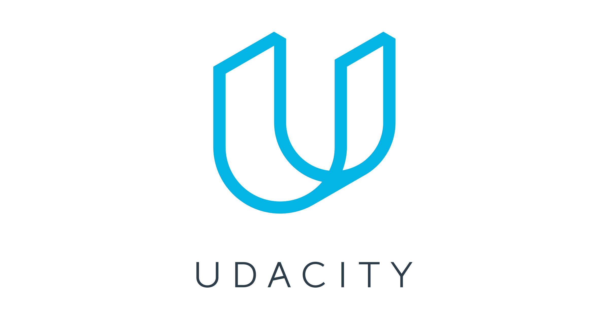

    
    <h1>Udacity Cloud DevOps Engineer Nanodegree</h1>
    
N.B.: Please don't use the assignment and quiz solution. Try to solve the problem by yourself.
 
    
Learn to design and deploy infrastructure as code, build and monitor CI/CD pipelines for different deployment strategies, and deploy scaleable microservices using Kubernetes. At the end of the program, you’ll combine your new skills by completing a capstone project. - <a href="https://www.udacity.com/course/cloud-dev-ops-nanodegree--nd9991">Source</a>

## Core Curriculum

### 1. Welcome to the Nanodegree Program

#### Lesson-1: Get Help with Your Account
| No |                                                        Lesson                                                         |                                                                                                                                  Notes                                                                                                                                   |                         Link/Source                          |
|:--:|:---------------------------------------------------------------------------------------------------------------------:|:-----------------------------------------------------------------------------------------------------------------------------------------------------------------------------------------------------------------------------------------------------------------------:|:------------------------------------------------------------:|
| 1 |                                                          FAQ                                                           |                                                                                                                           Udacity support, General question                                                                                                              |                       ------/------                          |
| 2 |                                                        Support                                                         |                                                                                                                          Udacity help center for the course                                                                                                              |                       ------/------                          |

#### Lesson-2: Welcome to Cloud DevOps Engineer Nanodegree Program
| No |                                                        Lesson                                                         |                                                                                                                                  Notes                                                                                                                                   |                         Link/Source                          |
|:--:|:---------------------------------------------------------------------------------------------------------------------:|:-----------------------------------------------------------------------------------------------------------------------------------------------------------------------------------------------------------------------------------------------------------------------:|:------------------------------------------------------------:|
| 1 |                                                Nanodegree Introduction                                                 |                                                                                                                       Importance of cloud service and the nanodegree                                                                                                     |                       ------/------                          |
| 2 |                                                 What you will build                                                    |                                                                                                                          Project portfolio, Project details                                                                                                              |                       ------/------                          |
| 3 |                                                    Pre-requisites                                                      |                                                                                                                Pre-requisites elements - programming, scripting & version controlling                                                                                    |                       ------/------                          |
| 4 |                                                AWS Setup Instructions                                                  |                                                                                                                         AWS account setup & credits                                                                                                                      |                       ------/------                          |

#### Lesson-3: Introduction to Cloud DevOps
| No |                                                        Lesson                                                         |                                                                                                                                  Notes                                                                                                                                   |                         Link/Source                          |
|:--:|:---------------------------------------------------------------------------------------------------------------------:|:-----------------------------------------------------------------------------------------------------------------------------------------------------------------------------------------------------------------------------------------------------------------------:|:------------------------------------------------------------:|
| 1 |                                                  Meet Your Instructors                                                 |                                                                                                                       Kesha Williams, Carlos Rivas, Noah Gift                                                                                                            |                       ------/------                          |
| 2 |                                                     Introduction                                                       |                                                                                                                           Lesson objective                                                                                                                               |                       ------/------                          |
| 3 |                                              Support for DevOps Adoption                                               |                                                                                                                 Answer about adoption the cloud servic                                                                                                                   |                       ------/------                          |
| 4 |                                                All In vs Baby Steps                                                    |                                                                                                                     Interview - Question & Answer                                                                                                                        |                       ------/------                          |
| 5 |                                                Change Model (ELSA)                                                     |                                                                                                                  Event, Language, Structure and Agency                                                                                                                   |                       ------/------                          |
| 6 |                                                Success Predictors                                                      |                                                                                                                     Interview - Question & Answer                                                                                                                        |                       ------/------                          |
| 7 |                                              Coming from Grassroots _1                                                 |                                                                                                                  Interview - Question & Answer, Suggestion                                                                                                               |                       ------/------                          |
| 8 |                                                From Management_1                                                       |                                                                                                                       Interview - Question & Answer                                                                                                                      |                       ------/------                          |
| 9 |                                                    The Start                                                           |                                                                                                                       Interview - Question & Answer                                                                                                                      |                       ------/------                          |
|10 |                                          Working with Strong Hierarchy_1                                               |                                                                                                                      Interview - Question & Answer                                                                                                                       |                       ------/------                          |
|11 |                                                Dealing with Silos                                                      |                                                                                                                    Dealing with other team members                                                                                                                       |                       ------/------                          |
|12 |                                                 Best Practices                                                         |                                                                                                                      Postive thinking, Checklist                                                                                                                         |                       ------/------                          |
|13 |                                                   Metrics_1                                                            |                                                                                                                  Goal, Effective work, Mesearing the result                                                                                                              |                       ------/------                          |
|14 |                                         Antipattern Hiring a DevOps Team                                               |                                                                                                                         How can i help                                                                                                                                   |                       ------/------                          |

### 2. Cloud Fundamentals

#### Lesson-1: Cloud Computing
| No |                                                        Lesson                                                         |                                                                                                                                  Notes                                                                                                                                   |                         Link/Source                          |
|:--:|:---------------------------------------------------------------------------------------------------------------------:|:-----------------------------------------------------------------------------------------------------------------------------------------------------------------------------------------------------------------------------------------------------------------------:|:------------------------------------------------------------:|
| 1 |                                                   Course Introduction                                                  |                                                                                                                           Cloud benefits, Course content                                                                                                                 |                       ------/------                          |
| 2 |                                                  Instructor Introduction                                               |                                                                                                                                Kesha Williams                                                                                                                            |                       ------/------                          |
| 3 |                                                    Lesson Introduction                                                 |                                                                                                                             Cloud provider - AWS                                                                                                                         |                       ------/------                          |
| 4 |                                                 What is Cloud Computing?                                               |                                                                                                                     Cloud computing defination & characteristics                                                                                                         |                            [32]                              |
| 5 |                                                Types of Cloud Computing                                                |                                                                                                                            IaaS, PaaS, SaaS                                                                                                                              |                            [33]                              |
| 6 |                                            Cloud Computing Deployment Model                                            |                                                                                                                      Public, Private & Hybrid cloud                                                                                                                      |                       ------/------                          |
| 7 |                                                   Common Benefits                                                      |                                                                                                                        Benefits of cloud service                                                                                                                         |                       ------/------                          |
| 8 |                                                       Options                                                          |                                                                                                                         Popular cloud providers                                                                                                                          |                       ------/------                          |
| 9 |                                                      Services                                                          |                                                                                                                          Cloud based products                                                                                                                            |                            [34]                              |
|10 |                                               Global Infrastructure                                                    |                                                                                                                 Region, Availability zone, Edge location                                                                                                                 |                         [35 - 36]                            |
|11 |                                            Shared Responsibility Model                                                 |                                                                                                                AWS is responsible for security OF the cloud, we are responsible for security IN the cloud                                                                |                            [37]                              |
|12 |                                            Lab: Setup free-tier account                                                |                                                                                                                        AWS free-tier account setup                                                                                                                       |                       ------/------                          |
|13 |                                                Lesson Recap                                                            |                                                                                                                           Lesson Summary                                                                                                                                 |                       ------/------                          |

#### Lesson-2: Foundational & Compute Service
| No |                                                        Lesson                                                         |                                                                                                                                  Notes                                                                                                                                   |                         Link/Source                          |
|:--:|:---------------------------------------------------------------------------------------------------------------------:|:-----------------------------------------------------------------------------------------------------------------------------------------------------------------------------------------------------------------------------------------------------------------------:|:------------------------------------------------------------:|
| 1 |                                                   Lesson Introduction                                                  |                                                                                                                            Why cloud use?                                                                                                                                |                       ------/------                          |
| 2 |                                         Why do we need servers in the cloud?                                           |                                                                                                                    Local data center transfer to cloud, Cloud features                                                                                                   |                       ------/------                          |
| 3 |                                              Elastic Cloud Compute (EC2)                                               |                                                                                                                       Elastic server, EC2 benefits                                                                                                                       |                            [38]                              |
| 4 |                                          Demo - Elastic Cloud Compute (EC2)                                            |                                                                                                                     EC2 demo on AWS console, Types of EC2                                                                                                                |                       ------/------                          |
| 5 |                                              Elastic Block Store (EBS)                                                 |                                                                                                                          EBS defination, Tips of EBS                                                                                                                     |                            [39]                              |
| 6 |                                          Demo - Elastic Block Store (EBS)                                              |                                                                                                                             EBS location on EC2                                                                                                                          |                       ------/------                          |
| 7 |                              Why do we need security in the cloud for our servers?                                     |                                                                                                                      To create secure access in the network                                                                                                              |                       ------/------                          |
| 8 |                                            Virtual Private Cloud (VPC)                                                 |                                                                                                                            VPC details and tips                                                                                                                          |                         [40 - 42]                            |
| 9 |                                         Demo - Virtual Private Cloud (VPC)                                             |                                                                                                                          VPC demo on AWS console                                                                                                                         |                       ------/------                          |
|10 |                                            Lab - Launch an EC2 instance                                                |                                                                                                                  Access VPC service, Launch an EC2 instance, Attach an EBS volume                                                                                        |                       ------/------                          |
|11 |                                    Why do we need compute power in the cloud?                                          |                                                                                                                    Run code, No provisioning, Automatically scales, High availability                                                                                    |                       ------/------                          |
|12 |                                                     Lambda                                                             |                                                                                                                      AWS serverless service, Language support in Lambda                                                                                                  |                            [43]                              |
|13 |                                                  Demo - Lambda                                                         |                                                                                                                        Lambda demo on AWS console with Node.js                                                                                                           |                       ------/------                          |
|14 |                                        Lab - Create and execute a Lambda                                               |                                                                                                                              Excercise on Lambda                                                                                                                         |                       ------/------                          |
|15 |                                             Elastic Beanstalk                                                          |                                                                                                                    Orchestration service, Tips of Elastic Beanstalk                                                                                                      |                         [44 - 45]                            |
|16 |                                        Lab - Deploy App to Beanstalk                                                   |                                                                                                                            Excercise Beanstalk on AWS console                                                                                                            |                       ------/------                          |
|17 |                                             Lesson Recap                                                               |                                                                                                                         EC2, VPC, Lambda, Beanstalk                                                                                                                      |                       ------/------                          |

#### Lesson-3: Storage & Content Delivery
| No |                                                        Lesson                                                         |                                                                                                                                  Notes                                                                                                                                   |                         Link/Source                          |
|:--:|:---------------------------------------------------------------------------------------------------------------------:|:-----------------------------------------------------------------------------------------------------------------------------------------------------------------------------------------------------------------------------------------------------------------------:|:------------------------------------------------------------:|
| 1 |                                                   Lesson Introduction                                                  |                                                                                                                         Storage, Database, CDN                                                                                                                           |                       ------/------                          |
| 2 |                                          Why do we need storage in the cloud?                                          |                                                                                                                   Availability, Durability, Scalability (Horizontal, Vertical, Diagonal)                                                                                 |                       ------/------                          |
| 3 |                                                    S3 & Glacier                                                        |                                                                                                                       S3 services, S3 classes, Archiving                                                                                                                 |                         [46 - 49]                            |
| 4 |                                                Demo - S3 & Glacier                                                     |                                                                                                                     S3 bucket create, Versioning, Policy, Web hosting                                                                                                    |                       ------/------                          |
| 5 |                                                     DynamoDB                                                           |                                                                                                                    NoSQL, JSON format, Key-value, Used in mission critical system                                                                                        |                         [50 - 51]                            |
| 6 |                                                 Demo - DynamoDB                                                        |                                                                                                                           DynamoDB demo on AWS console                                                                                                                   |                       ------/------                          |
| 7 |                                                 Lab - DynamoDB                                                         |                                                                                                                             Table Name, Primary Key                                                                                                                      |                       ------/------                          |
| 8 |                                       Relational Database Service (RDS)                                                |                                                                                                                         Supported engine, RDS features                                                                                                                   |                         [52 - 54]                            |
| 9 |                                   Demo - Relational Database Service (RDS)                                             |                                                                                                                            RDS demo on AWS console                                                                                                                       |                       ------/------                          |
|10 |                                                   RedShift                                                             |                                                                                                                     Big data, ETL, BI, Fast query analysis                                                                                                               |                         [55 - 56]                            |
|11 |                                                  Lab - RDS                                                             |                                                                                                                    Run code, No provisioning, Automatically scales, High availability                                                                                    |                       ------/------                          |
|12 |                                   Why do we need content delivery in the cloud?                                        |                                                                                                                    Speeds up delivery, Web pages, Cached, Reduces latency                                                                                                |                       ------/------                          |
|13 |                                                 Cloud Front                                                            |                                                                                                                          Cached, Edge location                                                                                                                           |                         [57 - 58]                            |
|14 |                                             Demo - Cloud Front                                                         |                                                                                                                      Cloudfront demo on AWS console                                                                                                                      |                       ------/------                          |
|15 |                                           Lab - S3 & Cloud Front                                                       |                                                                                                                    S3 bucket create and Using CDN service                                                                                                                |                       ------/------                          |
|16 |                                                Lesson Recap                                                            |                                                                                                                       S3, DynamoDB, RDS, RedShift, CDN                                                                                                                   |                       ------/------                          |

#### Lesson-4: Security
| No |                                                        Lesson                                                         |                                                                                                                                  Notes                                                                                                                                   |                         Link/Source                          |
|:--:|:---------------------------------------------------------------------------------------------------------------------:|:-----------------------------------------------------------------------------------------------------------------------------------------------------------------------------------------------------------------------------------------------------------------------:|:------------------------------------------------------------:|
| 1 |                                                   Lesson Introduction                                                  |                                                                                                                    Security services, Protect data on the cloud                                                                                                          |                       ------/------                          |
| 2 |                                        Why do we need security for applications?                                       |                                                                                                                   Reduce hacking, Protect personal information & applications                                                                                            |                       ------/------                          |
| 3 |                                                     AWS Shield                                                         |                                                                                                                           DDos protection, Detect malicious traffic                                                                                                      |                            [59]                              |
| 4 |                                           AWS Web Application Firewall                                                 |                                                                                                                     Web protection, Incoming & Outcoming, SQL injection                                                                                                  |                            [60]                              |
| 5 |                                       Identity and Access Management (IAM)                                             |                                                                                                                    Global service, MFA, User, IAM role & group, Policy                                                                                                   |                         [61 - 62]                            |
| 6 |                                   Demo - Identity and Access Management (IAM)                                          |                                                                                                                           IAM demo on AWS console                                                                                                                        |                       ------/------                          |
| 7 |                                                   Lab - IAM                                                            |                                                                                                                             Excercise on IAM                                                                                                                             |                       ------/------                          |
| 8 |                                                 Lesson Recap                                                           |                                                                                                                      Security in the cloud, Sheild, WAF, IAM                                                                                                             |                       ------/------                          |

#### Lesson-5: Networking & Elasticity
| No |                                                        Lesson                                                         |                                                                                                                                  Notes                                                                                                                                   |                         Link/Source                          |
|:--:|:---------------------------------------------------------------------------------------------------------------------:|:-----------------------------------------------------------------------------------------------------------------------------------------------------------------------------------------------------------------------------------------------------------------------:|:------------------------------------------------------------:|
| 1 |                                                   Lesson Introduction                                                  |                                                                                                                   Network connectivity, Route internet traffic, Inbound & Outbound                                                                                       |                       ------/------                          |
| 2 |                                       Why do we need networking in the cloud?                                          |                                                                                                                 Delivery of content and applications, Foundation of infrastructure                                                                                       |                       ------/------                          |
| 3 |                                                       Route 53                                                         |                                                                                                                            AWS DNS service                                                                                                                               |                            [63]                              |
| 4 |                                       Why do we need elasticity in the cloud?                                          |                                                                                                                     Stop guessing about capacity, Scale up & down                                                                                                        |                       ------/------                          |
| 5 |                                                  EC2 Auto Scaling                                                      |                                                                                                                         Automatically control, Monitoring                                                                                                                |                         [64 - 65]                            |
| 6 |                                              Demo - EC2 Auto Scaling                                                   |                                                                                                                         Auto scalling demo on AWS console                                                                                                                |                       ------/------                          |
| 7 |                                              Elastic Load Balancing                                                    |                                                                                                                   Blancing the loads, Redundancy and performance                                                                                                         |                            [66]                              |
| 8 |                                          Demo - Elastic Load Balancing                                                 |                                                                                                                      Security in the cloud, Sheild, WAF, IAM                                                                                                             |                       ------/------                          |
| 9 |                                            Lab - EC2 Auto Scaling                                                      |                                                                                                                          Excercise on EC2 Auto scalling                                                                                                                  |                       ------/------                          |
|10 |                                                 Lesson Recap                                                           |                                                                                                                              AWS network services                                                                                                                        |                       ------/------                          |

#### Lesson-6: Messaging  & Containers
| No |                                                        Lesson                                                         |                                                                                                                                  Notes                                                                                                                                   |                         Link/Source                          |
|:--:|:---------------------------------------------------------------------------------------------------------------------:|:-----------------------------------------------------------------------------------------------------------------------------------------------------------------------------------------------------------------------------------------------------------------------:|:------------------------------------------------------------:|
| 1 |                                                   Lesson Introduction                                                  |                                                                                                                   Notification or alert services on AWS                                                                                                                  |                       ------/------                          |
| 2 |                                        Why do we need messaging in the cloud?                                          |                                                                                                                         To notify the clients                                                                                                                            |                       ------/------                          |
| 3 |                                           Simple Notification Service (SNS)                                            |                                                                                                                    Used for large number of subscribers, Publish/subscribe model                                                                                         |                         [67 - 68]                            |
| 4 |                                       Demo - Simple Notification Service (SNS)                                         |                                                                                                                        SNS service demo on AWS console                                                                                                                   |                       ------/------                          |
| 5 |                                         Why do we need queuing technology?                                             |                                                                                                                      FIFO, Asynchronous processing                                                                                                                       |                       ------/------                          |
| 6 |                                           Simple Queue Service (SQS)                                                   |                                                                                                                      Send messages, Store messages, Receive messages                                                                                                     |                         [69 - 70]                            |
| 7 |                                          Demo - Simple Queue Service                                                   |                                                                                                                         SQS service demo on AWS console                                                                                                                  |                       ------/------                          |
| 8 |                                                Lab - SNS                                                               |                                                                                                                          Excercise on SNS service                                                                                                                        |                       ------/------                          |
| 9 |                                          Why do we need containers?                                                    |                                                                                                                     All bundled into one package, Independent component                                                                                                  |                         [71 - 72]                            |
|10 |                                       Elastic Container Service (ECS)                                                  |                                                                                                                     Orchestration service, Only supported Docker in AWS                                                                                                  |                         [73 - 74]                            |
|11 |                                      Demo - Elastic Container Service                                                  |                                                                                                                         ECS service demon on AWS console                                                                                                                 |                       ------/------                          |
|12 |                                             Lesson Recap                                                               |                                                                                                                   Notification services as - SNS & SQS, Container service                                                                                                |                       ------/------                          |

#### Lesson-7: AWS Management
| No |                                                        Lesson                                                         |                                                                                                                                  Notes                                                                                                                                   |                         Link/Source                          |
|:--:|:---------------------------------------------------------------------------------------------------------------------:|:-----------------------------------------------------------------------------------------------------------------------------------------------------------------------------------------------------------------------------------------------------------------------:|:------------------------------------------------------------:|
| 1 |                                                      Introduction                                                      |                                                                                                                     Efficently uses the AWS management services                                                                                                          |                       ------/------                          |
| 2 |                                     Why do we need logging and auditing in the cloud?                                  |                                                                                                                   Server performance, Load on the server, Root cause                                                                                                     |                       ------/------                          |
| 3 |                                                      Cloud Trail                                                       |                                                                                                                    Audit the AWS account, Provide log file                                                                                                               |                            [75]                              |
| 4 |                                                  Demo - Cloud Trail                                                    |                                                                                                                       Cloud trail demo on AWS console                                                                                                                    |                       ------/------                          |
| 5 |                                                      Cloud Watch                                                       |                                                                                                                      Monitors resources and applications                                                                                                                 |                         [76 - 77]                            |
| 6 |                                                  Demo - Cloud Watch                                                    |                                                                                                                        Cloud watch demo on AWS console                                                                                                                   |                       ------/------                          |
| 7 |                                                  Lab - Cloud Watch                                                     |                                                                                                                           Cloud watch excercise                                                                                                                          |                       ------/------                          |
| 8 |                                 What is Infrastructure as Code and why do we need it?                                  |                                                                                                                         Used script programe, Time-saving                                                                                                                |                            [78]                              |
| 9 |                                                   Cloud Formation                                                      |                                                                                                                     AWS IaaS, JSON or YAML, CloudForamtion stack                                                                                                         |                         [79 - 80]                            |
|10 |                                               Demo - Cloud Formation                                                   |                                                                                                                       Cloud formation demo on AWS console                                                                                                                |                       ------/------                          |
|11 |                                               Lab - Cloud Formation                                                    |                                                                                                                           Cloud formation excercise                                                                                                                      |                       ------/------                          |
|12 |                                         AWS Command Line Interface (CLI)                                               |                                                                                                                   Access and control services, Command Line                                                                                                              |                            [81]                              |
|13 |                                     Demo - AWS Command Line Interface (CLI)                                            |                                                                                                                        CLI for EC2, SNS, SQS, S3                                                                                                                         |                       ------/------                          |
|14 |                                                Lesson Recap                                                            |                                                                                                                        Cloud watch, Cloud trail                                                                                                                          |                       ------/------                          |
|15 |                                                Course Recap                                                            |                                                                                                                  Storage, Database, Security, Networking, Elasticity, Messages, Queue, Container                                                                         |                       ------/------                          |

 

## Extracurricular

### 1. Prerequisite: Networking

#### Lesson-1: Networking
| No |                                                        Lesson                                                         |                                                                                                                                  Notes                                                                                                                                   |                         Link/Source                          |
|:--:|:---------------------------------------------------------------------------------------------------------------------:|:-----------------------------------------------------------------------------------------------------------------------------------------------------------------------------------------------------------------------------------------------------------------------:|:------------------------------------------------------------:|
| 1 |                                                       Interview                                                        |                                                                                                                    Security, Goal, Categories of security                                                                                                                |                       ------/------                          |
| 2 |                                           Lesson Map & Learning Objectives                                             |                                                                                                                           Lesson path and objecive                                                                                                                       |                       ------/------                          |
| 3 |                                             Network Communication Model                                                |                                                                                                                Components of Networking - Medium, Addressing & Content                                                                                                   |                       ------/------                          |
| 4 |                                                      Addressing                                                        |                                                                                                                         IPv4 - 32 bits, limitation                                                                                                                       |                          [1 - 3]                             |
| 5 |                                               Addressing and Networks                                                  |                                                                                                                        Network prefix, Host address, 253 unique host address for /24, CIDR                                                                               |                          [4 - 10]                            |
| 6 |                                                       OSI Model                                                        |                                                                                                                                Layer of OSI model                                                                                                                        |                         [11 - 14]                            |
| 7 |                                                       Switching                                                        |                                                                                                                            Local area network trafic                                                                                                                     |                         [15 - 16]                            |
| 8 |                                                    Frame Structure                                                     |                                                                                                                             Ethernet packet & frame                                                                                                                      |                         [17 - 18]                            |
| 9 |                                                  Switching At Scale                                                    |                                                                                                                         Trunk link, switch port, router                                                                                                                  |                       ------/------                          |
|10 |                                                     Virtual LANs                                                       |                                                                                                                            Virtual LANs useness                                                                                                                          |                       ------/------                          |
|11 |                                                       Routing                                                          |                                                                                                                    Router, Routing tables, Private IP address, NAT, IPv6                                                                                                 |                         [19 - 22]                            |
|12 |                                                      Wireshark                                                         |                                                                                                                            Network packet analyzer - wireshark                                                                                                           |                         [23 - 25]                            |
|13 |                                                 Domain Name System                                                     |                                                                                                                              FQDN, TLD, Hostname, Domain, DNS                                                                                                            |                         [26 - 27]                            |
|14 |                                                Types of DNS Records                                                    |                                                                                                                               Local cache, DNS record types                                                                                                              |                            [28]                              |
|15 |                                                    DNS Hierarchy                                                       |                                                                                                                    Root servers, TLD, Sub-domain, hostname, IP address                                                                                                   |                         [29 - 30]                            |
|16 |                                                   Load Balancing                                                       |                                                                                                                            Load Balancing necessity                                                                                                                      |                       ------/------                          |
|17 |                                             Load Balancing Approaches                                                  |                                                                                                                      Round robic, BGP anycast, Policy-based, Dedicated                                                                                                   |                            [31]                              |
|18 |                                                      Outro                                                             |                                                                                                                              Summary of  the lesson                                                                                                                      |                       ------/------                          |

## Resources

* [1][RFC 6890 - Special-Purpose IP Address Registries, April 2013](https://tools.ietf.org/html/rfc6890)
* [2][RFC 1918 - Address Allocation for Private Internets, February 1996](https://tools.ietf.org/html/rfc1918)
* [3][Wikipedia - IPv4 Address Exhaustion](https://en.wikipedia.org/wiki/IPv4_address_exhaustion)
* [4][IP Address to Binary](https://www.browserling.com/tools/ip-to-bin)
* [5][Binary to IP Address](https://www.browserling.com/tools/bin-to-ip)
* [6][Subnetworks](https://en.wikipedia.org/wiki/Subnetwork)
* [7][CIDR](https://en.wikipedia.org/wiki/Classless_Inter-Domain_Routing)
* [8][RFC IPv4](https://tools.ietf.org/html/rfc1878)
* [9][RFC IPv6](https://tools.ietf.org/html/rfc5942)
* [10][RFC CIDR](https://www.rfc-editor.org/rfc/rfc1519.txt)
* [11][OSI model](https://en.wikipedia.org/wiki/OSI_model)
* [12][The OSI Model Demystified](https://www.youtube.com/watch?v=HEEnLZV2wGI)
* [13][The 7 Layers of the OSI Model](https://www.webopedia.com/quick_ref/OSI_Layers.asp)
* [14][Packet Switching](https://en.wikipedia.org/wiki/Packet_switching)
* [15][Network Switches](https://en.wikipedia.org/wiki/Network_switch)
* [16][Spanning Tree Protocol](https://en.wikipedia.org/wiki/Spanning_Tree_Protocol)
* [17][Wikipedia article on Ethernet frames](https://en.wikipedia.org/wiki/Ethernet_frame)
* [18][A Networking Frame](https://en.wikipedia.org/wiki/Frame_(networking)
* [19][What is my ip](https://www.whatismyip.com/)
* [20][IPv6 test site](http://test-ipv6.com/)
* [21][TCP/IP and Subnet Masking](https://www.youtube.com/watch?v=EkNq4TrHP_U)
* [22][Wikipedia article on NAT](https://en.wikipedia.org/wiki/Network_address_translation)
* [23][Wireshark User Guide](https://www.wireshark.org/docs/wsug_html_chunked/)
* [24][Wireshark Wiki](https://en.wikipedia.org/wiki/Wireshark)
* [25][Wireshark link for download](https://www.wireshark.org/download.html)
* [26][FQDN](http://www.rfc-base.org/rfc-4703.html)
* [27][Domain Name System IANA Considerations 2011](https://www.rfc-archive.org/getrfc.php?rfc=6195)
* [28][Nameservers for IPv4 and IPv6 Reverse Zones (2010)](https://www.rfc-archive.org/getrfc.php?rfc=5855)
* [29][Wikipedia article on the Domain Name System](https://en.wikipedia.org/wiki/Domain_Name_System)
* [30][Wikipedia article on DNS record types](https://en.wikipedia.org/wiki/List_of_DNS_record_types)
* [31][Load Balancing](https://en.wikipedia.org/wiki/Load_balancing_(computing))
* [32] [Cloud Computing](https://aws.amazon.com/what-is-cloud-computing/)
* [33] [Types of Cloud Computing](https://aws.amazon.com/types-of-cloud-computing/)
* [34] [AWS Cloud Products](https://aws.amazon.com/products/)
* [35] [Global Infrastructure](https://aws.amazon.com/about-aws/global-infrastructure/)
* [36] [Regions & Availability Zones](https://aws.amazon.com/about-aws/global-infrastructure/regions_az/)
* [37] [Shared Responsibility Model](https://aws.amazon.com/compliance/shared-responsibility-model/)
* [38] [Amazon Elastic Cloud Compute](https://www.amazonaws.cn/en/ec2/)
* [39] [Amazon Elastic Block Store](https://docs.aws.amazon.com/AWSEC2/latest/UserGuide/AmazonEBS.html)
* [40] [Virtual Private Cloud](https://en.wikipedia.org/wiki/Virtual_private_cloud)
* [41] [Amazon Virtual Private Cloud](https://aws.amazon.com/vpc/)
* [42] [Amazon VPC Documentation](https://docs.aws.amazon.com/vpc/latest/userguide/what-is-amazon-vpc.html)
* [43] [AWS Lambda](https://aws.amazon.com/lambda/)
* [44] [AWS Elastic Beanstalk Overview](https://aws.amazon.com/elasticbeanstalk/)
* [45] [What is AWS Elastic Beanstalk](https://docs.aws.amazon.com/elasticbeanstalk/latest/dg/Welcome.html)
* [46] [Amazon S3 Storage Classes](https://aws.amazon.com/s3/storage-classes/)
* [47] [Amazon S3](https://aws.amazon.com/s3/)
* [48] [Amazon S3 Glacier](https://aws.amazon.com/glacier/)
* [49] [What is Amazon S3 Glacier](https://docs.aws.amazon.com/amazonglacier/latest/dev/introduction.html)
* [50] [Amazon DynamoDB Overview](https://aws.amazon.com/dynamodb/)
* [51] [What is Amazon DynamoDB](https://docs.aws.amazon.com/amazondynamodb/latest/developerguide/Introduction.html)
* [52] [What Is A Relational Database](https://aws.amazon.com/relational-database/)
* [53] [Amazon Relational Database Service](https://aws.amazon.com/rds/)
* [54] [AWS Product Databases using Relational Databases](https://aws.amazon.com/products/databases/)
* [55] [What Is Amazon Redshift](https://docs.aws.amazon.com/redshift/latest/mgmt/welcome.html)
* [56] [Amazon Redshift Overview](https://aws.amazon.com/redshift/)
* [57] [Amazon CloudFront Overview](https://aws.amazon.com/cloudfront/)
* [58] [What is Amazon CloudFront](https://docs.aws.amazon.com/AmazonCloudFront/latest/DeveloperGuide/Introduction.html)
* [59] [AWS Shield Overview](https://aws.amazon.com/shield/)
* [60] [AWS Web Application Firewall](https://aws.amazon.com/waf/)
* [61] [AWS IAM Overview](https://aws.amazon.com/iam/)
* [62] [What is IAM](https://docs.aws.amazon.com/IAM/latest/UserGuide/introduction.html)
* [63] [Amazon Route 53 Overview](https://aws.amazon.com/route53/)
* [64] [Amazon EC2 Autoscaling Overview](https://aws.amazon.com/ec2/autoscaling/)
* [65] [What is Amazon EC2 Autoscaling](https://docs.aws.amazon.com/autoscaling/ec2/userguide/what-is-amazon-ec2-auto-scaling.html)
* [66] [Amazon Elastic Load Balancing Overview](https://aws.amazon.com/elasticloadbalancing/)
* [67] [Amazon SNS Overview](https://aws.amazon.com/sns/)
* [68] [What is Amazon SNS](https://docs.aws.amazon.com/sns/latest/dg/welcome.html)
* [69] [Amazon SQS Overview](https://aws.amazon.com/sqs/)
* [70] [What is Amazon SQS](https://docs.aws.amazon.com/AWSSimpleQueueService/latest/SQSDeveloperGuide/welcome.html)
* [71] [General overview about Docker containers](https://docs.docker.com/engine/docker-overview/)
* [72] [Documentation on Docker Containers](https://www.docker.com/resources/what-container)
* [73] [Amazon ECS Overview](https://aws.amazon.com/ecs/)
* [74] [What is Amazon ECS](https://docs.aws.amazon.com/AmazonECS/latest/developerguide/Welcome.html)
* [75] [AWS CloudTrail Overview](https://aws.amazon.com/cloudtrail/)
* [76] [AWS CloudWatch Overview](https://aws.amazon.com/cloudwatch/)
* [77] [What is Amazon CloudWatch](https://docs.aws.amazon.com/AmazonCloudWatch/latest/monitoring/WhatIsCloudWatch.html)
* [78] [Infrastructure as Code](https://en.wikipedia.org/wiki/Infrastructure_as_code)
* [79] [AWS CloudFormation Overview](https://aws.amazon.com/cloudformation/)
* [80] [What is AWS CloudFormation](https://docs.aws.amazon.com/AWSCloudFormation/latest/UserGuide/Welcome.html)
* [81] [AWS Command Line Interface](https://aws.amazon.com/cli/)